# KIKI Agent™ Cross-Platform Differential Logic

**Document Type**: Technical Implementation Guide  
**Last Updated**: February 7, 2026  
**Purpose**: Visual reference for KIKI's sovereign intelligence layer across Meta, Google, TikTok, LinkedIn, Amazon, and Microsoft Ads

---

## Overview

This document provides **Mermaid diagrams and flowcharts** illustrating how the Council of Nine agents orchestrate LTV-based bidding across 6 ad platforms. Unlike native platform tools (Meta Advantage+, Google PMax) that optimize for immediate ROAS, KIKI creates a **sovereign governance layer** that optimizes for **Net Profit Uplift**.

**Key Differentiator**: KIKI can "say no" to platforms. If Meta CPMs spike and projected LTV is negative, SyncTwin blocks the campaign. Meta can't do this because they have a conflict of interest—they profit when you spend more.

---

## 1. The Sovereign Intelligence Architecture


**Key Gates**:
1. **SyncTwin Gate** (Step 5): Blocks unprofitable campaigns BEFORE launch
2. **SyncShield Gate** (Step 8): Blocks risky creatives BEFORE deployment
3. **MarginGuardian Gate** (Step 9): Suppresses individual bids if LTV < ROI threshold

---

## 2. LTV-Based Bidding Flow (SyncValue → SyncFlow)

This is the **core competitive moat**. Before any bid is submitted, SyncFlow must consult SyncValue to get the predicted LTV.

```mermaid
sequenceDiagram
    autonumber
    participant Platform as Ad Platform<br/>(Meta/Google/TikTok)
    participant Adapter as Platform Adapter<br/>(meta_adapter.go)
    participant Flow as SyncFlow<br/>(Bidding Engine)
    participant Value as SyncValue<br/>(LTV Predictor)
    participant Brain as SyncBrain<br/>(ROI Threshold)
    participant Ledger as SyncLedger<br/>(Net Profit Tracking)
    
    Platform->>Adapter: Bid opportunity<br/>(UserFBID, AdID, MaxBid)
    Adapter->>Flow: Normalized BidRequest<br/>(UserSignals, Platform, CreativeID)
    Flow->>Value: POST /predict-ltv<br/>(UserSignals, Platform, CreativeID)
    Value->>Value: Load dRNN model<br/>(ltv_dRNN_meta.pt)
    Value->>Value: Feature engineering<br/>(page_views, cart_adds, time_on_site)
    Value->>Value: Predict LTV<br/>(e.g., $450)
    Value->>Flow: LTVResponse<br/>(predicted_ltv: $450,<br/>confidence_score: 0.82,<br/>risk_profile: "moderate")
    Flow->>Brain: GET /roi-threshold<br/>(client_id)
    Brain->>Flow: ROI threshold<br/>(e.g., 3.5x)
    
    alt LTV < ROI Threshold (MarginGuardian Circuit Breaker)
        Flow->>Flow: expectedROI = $450 / $120 = 3.75x<br/>✅ ROI (3.75x) > threshold (3.5x)
        Flow->>Flow: Calculate Kelly Fraction<br/>(bid = $450 × 0.25 = $112.50)
        Flow->>Ledger: Record bid event<br/>(user_id, platform, bid_amount, predicted_ltv)
        Flow->>Platform: Submit bid ($112.50)
    else LTV Too Low (Suppress Bid)
        Flow->>Flow: expectedROI = $300 / $120 = 2.5x<br/>❌ ROI (2.5x) < threshold (3.5x)
        Flow->>Flow: MarginGuardian: BID SUPPRESSED
        Flow->>Platform: No bid submitted
    end
```



**Why This Matters**:
- **Meta Advantage+**: Bids on every opportunity to maximize spend
- **KIKI**: Only bids when projected LTV justifies the cost

**Example Scenario**:
- **User Signal**: 3 page views, 1 cart add, 45 seconds on site
- **Meta's Logic**: "User engaged, bid $120!"
- **KIKI's Logic**: 
  - SyncValue predicts LTV = $300 (low confidence: 0.65)
  - ROI threshold = 3.5x
  - Expected ROI = $300 / $120 = 2.5x < 3.5x
  - **MarginGuardian**: Bid suppressed
  - **Meta gets $0**
  - **Client saves $120** (would have lost money)

---

## 3. Data Normalization (Unified BidRequest Schema)

Each ad platform has different API schemas. KIKI normalizes these into a unified `BidRequest` protobuf.


**Normalization Benefits**:
1. **Single LTV Model**: SyncValue doesn't need 6 different models (one per platform)
2. **Cross-Platform Comparison**: Can rank users across all platforms by predicted LTV
3. **Budget Reallocation**: If Meta users have lower LTV than TikTok, shift budget automatically

---

## 4. SyncShield Safety Gate (Brand Safety & Compliance)

Before any creative is deployed, it must pass through SyncShield's risk scan.

```mermaid
stateDiagram-v2
    [*] --> CreativeGeneration: SyncCreate generates<br/>5 creative variants
    
    CreativeGeneration --> RiskScan: Pass ALL variants<br/>to SyncShield
    
    RiskScan --> BrandSafetyML: Step 1: ML Classifier<br/>(NSFW, violence, hate speech)
    BrandSafetyML --> PolicyCheck: Step 2: Platform Policies<br/>(Meta/Google/TikTok rules)
    PolicyCheck --> ComplianceCheck: Step 3: GDPR/SOC2<br/>(data minimization, PII)
    
    ComplianceCheck --> RiskScoreCalc: Aggregate risk_score<br/>(0.0 = safe, 1.0 = high risk)
    
    RiskScoreCalc --> Approved: risk_score < 0.3<br/>✅ APPROVED
    RiskScoreCalc --> Rejected: risk_score ≥ 0.3<br/>❌ REJECTED
    
    Approved --> DeployCheck: Count approved variants
    Rejected --> AuditLog: Log rejection reason<br/>to SyncShield audit trail
    
    DeployCheck --> SyncFlow: ≥2 variants approved<br/>Deploy to platforms
    DeployCheck --> GoldStandard: <2 variants approved<br/>Fall back to Gold Standard
    
    GoldStandard --> SyncFlow: Deploy Gold Standard assets
    SyncFlow --> [*]: Campaign launched
    AuditLog --> CreativeGeneration: Retry with<br/>adjusted brand voice
```



**Safety Thresholds**:
- **risk_score < 0.3**: Approved (safe for all platforms)
- **0.3 ≤ risk_score < 0.6**: Warning (manual review required)
- **risk_score ≥ 0.6**: Rejected (violates brand safety or compliance)

**Example Rejection Reasons**:
1. **NSFW Content**: ML classifier detected skin tone > 40% of pixels
2. **Meta Policy Violation**: Before/after imagery (prohibited by Meta)
3. **GDPR Violation**: Creative contained PII without consent
4. **Trademark Infringement**: Competitor logo detected in background

**Gold Standard Assets**:
- Pre-approved creatives that passed SyncShield with risk_score < 0.1
- Used as fallback when auto-generated creatives fail brand safety
- Updated quarterly based on performance data

---

## 5. Automatic Rollback & Circuit Breakers

KIKI continuously monitors campaign performance and triggers automatic rollback if real performance deviates from SyncTwin projections.


**Rollback Triggers**:
1. **CTR Drop** (Click-Through Rate): Real CTR < 80% of baseline
2. **CVR Drop** (Conversion Rate): Real CVR < 75% of baseline
3. **CPC Spike** (Cost-Per-Click): Real CPC > 125% of baseline
4. **Risk Score** (Aggregate): risk_score > 0.8

**Circuit Breaker Modes**:
- **Normal Mode**: Full budget, autonomous operation
- **Conservative Mode**: 50% budget cap, bid conservatively
- **Human-Gated Mode**: Requires manual approval for every change

**Why Competitors Can't Copy**:
- **Meta/Google**: Have conflict of interest (they profit when you overspend, so they won't build auto-pause)
- **SaaS Tools**: Don't have SyncTwin (no baseline projection to compare against)
- **Legacy Platforms**: Too slow to react (5-minute cron vs. KIKI's real-time monitoring)

---

## 6. Net Profit Uplift Attribution (OaaS Settlement)

The final step is **SyncLedger** calculating Net Profit Uplift by comparing real revenue against baselines.


**Key Insight**: KIKI only charges 20% of **Net Profit Uplift**, not gross revenue. If ad costs eat profit, KIKI doesn't get paid.

**Example Calculation**:
```python
# Month 1 (KIKI campaigns running)
new_revenue = $45,000  # From Shopify
new_ad_spend = $12,000  # Meta: $5k, Google: $4k, TikTok: $3k

# Baseline (90-day historical average before KIKI)
baseline_revenue = $32,000
baseline_ad_spend = $8,000

# Net Profit Uplift calculation
revenue_uplift = $45,000 - $32,000 = $13,000
ad_spend_increase = $12,000 - $8,000 = $4,000
net_profit_uplift = $13,000 - $4,000 = $9,000

# KIKI fee (20% of Net Profit Uplift)
kiki_fee = $9,000 × 0.20 = $1,800

# Client keeps 80%
client_profit = $9,000 × 0.80 = $7,200
```

**What If Campaigns Lose Money?**
```python
# Month 2 (Ad costs spike, no revenue uplift)
new_revenue = $34,000  # Slight increase
new_ad_spend = $15,000  # Meta CPMs spiked +50%

# Baseline (same as before)
baseline_revenue = $32,000
baseline_ad_spend = $8,000

# Net Profit Uplift calculation
revenue_uplift = $34,000 - $32,000 = $2,000
ad_spend_increase = $15,000 - $8,000 = $7,000
net_profit_uplift = $2,000 - $7,000 = -$5,000  # NEGATIVE

# KIKI fee (only charged if net_profit_uplift > 0)
kiki_fee = max(0, -$5,000 × 0.20) = $0  # KIKI earns $0

# Client risk
# Traditional Agency: Would charge $10k flat fee (total loss: $15k)
# KIKI: Charges $0 (total loss: $5k ad spend increase)
```

**Why This Protects the Client**:
- **Traditional Agencies**: Charge $10k-$50k/month regardless of results
- **Meta/Google**: No protection against overspend (they profit when you lose money)
- **KIKI**: Only charges when client profits (aligned incentives)

---

## 7. Multi-Platform Budget Reallocation

KIKI can shift budget across platforms in real-time based on LTV performance.


**Scenario**: Day 1-3, Meta performs best (LTV $450). Day 4, Meta CPMs spike +50%. SyncFlow automatically shifts $50/day to TikTok (LTV $420, lower CPMs).

**Decision Logic**:
```go
// In SyncFlow budget optimizer
func (s *SyncFlowService) ReallocateBudget(ctx context.Context) error {
    platforms := []string{"meta", "google", "tiktok", "linkedin", "amazon", "microsoft"}
    
    // Get LTV per platform
    platformLTV := make(map[string]float64)
    for _, platform := range platforms {
        ltv := s.syncValueClient.GetPlatformLTV(ctx, platform)
        cpm := s.getPlatformCPM(ctx, platform)
        platformLTV[platform] = ltv / cpm  // LTV per $1 spent
    }
    
    // Rank platforms by LTV efficiency
    ranked := rankByValue(platformLTV)  // ["tiktok", "meta", "google", ...]
    
    // Shift 20% of budget to top performer
    totalBudget := s.getTotalBudget(ctx)
    s.setPlatformBudget(ctx, ranked[0], totalBudget * 0.35)  // 35% to best
    s.setPlatformBudget(ctx, ranked[1], totalBudget * 0.25)  // 25% to 2nd
    s.setPlatformBudget(ctx, ranked[2], totalBudget * 0.20)  // 20% to 3rd
    
    return nil
}
```

**Why Competitors Can't Do This**:
- **Meta Advantage+**: Meta-only (can't shift to Google)
- **Google PMax**: Google-only (can't shift to TikTok)
- **Albert.ai**: Cross-platform, but SaaS pricing (no incentive to reduce spend)
- **KIKI**: Only earns when client profits, so MUST optimize across platforms

---

## 8. Competitive Advantage Summary

| Feature | Meta/Google Native | SaaS Tools (Albert.ai) | KIKI Agent™ |
|---------|-------------------|----------------------|-------------|
| **LTV-Based Bidding** | ❌ No (ROAS-based) | ❌ No (external integration) | ✅ Yes (SyncValue dRNN) |
| **Pre-Launch Validation** | ❌ No | ❌ No | ✅ Yes (SyncTwin 10,000 simulations) |
| **Automatic Rollback** | ❌ No (conflict of interest) | ⚠️ Manual only | ✅ Yes (5-min cron, auto-pause) |
| **Cross-Platform Optimization** | ❌ No (single platform) | ✅ Yes (6 platforms) | ✅ Yes (6 platforms) |
| **OaaS Pricing** | ❌ No (ad-spend based) | ❌ No (SaaS subscription) | ✅ Yes (20% of Net Profit) |
| **Safe-Fail Built-in** | ❌ No | ❌ No | ✅ Yes (SyncShield + SyncTwin) |
| **Net Profit Tracking** | ❌ No (just revenue) | ⚠️ Limited | ✅ Yes (SyncLedger double-entry) |
| **Brand Safety** | ⚠️ Basic | ⚠️ External tools | ✅ Yes (SyncShield ML + audit) |

**KIKI's Unique Value Proposition**:
> _"The only platform that can 'say no' to itself. If a campaign is predicted to lose money, SyncTwin blocks it BEFORE launch. Meta/Google can't do this because they profit when you overspend. KIKI only earns when you profit."_

---

## 9. Implementation Checklist for GitHub Copilot

When using `@workspace /agent` to build KIKI Agent™ services, follow this checklist:

### **Phase 1: Protocol Buffers (gRPC Schemas)**
- [ ] Create `/schemas/bid_request.proto` (unified BidRequest schema)
- [ ] Create `/schemas/ltv_request.proto` (SyncValue API schema)
- [ ] Create `/schemas/risk_scan.proto` (SyncShield API schema)
- [ ] Generate Go bindings: `protoc --go_out=. --go-grpc_out=. *.proto`
- [ ] Generate Python bindings: `python -m grpc_tools.protoc ...`

### **Phase 2: SyncValue (LTV Prediction Engine)**
- [ ] Implement `/services/syncvalue/app/ltv_predictor.py`
  - [ ] `POST /predict-ltv` endpoint
  - [ ] dRNN model loading (`ltv_dRNN_meta.pt`, `ltv_dRNN_google.pt`, etc.)
  - [ ] Feature engineering (UserSignals → model input)
  - [ ] Baseline calculation (`get_baseline_ltv()`)
- [ ] Integration: Redis cache for sub-millisecond LTV lookups

### **Phase 3: SyncFlow (Cross-Platform Bidding)**
- [ ] Implement `/services/syncflow/app/margin_guardian.go`
  - [ ] `DecideBid()` function with LTV governor logic
  - [ ] MarginGuardian circuit breaker (suppress bids if LTV < ROI threshold)
  - [ ] Kelly Criterion for risk-adjusted bid sizing
- [ ] Create platform adapters:
  - [ ] `/services/syncflow/app/adapters/meta_adapter.go`
  - [ ] `/services/syncflow/app/adapters/google_adapter.go`
  - [ ] `/services/syncflow/app/adapters/tiktok_adapter.go`
- [ ] Integration: gRPC client for SyncValue, SyncBrain, SyncLedger

### **Phase 4: SyncShield (Brand Safety & Compliance)**
- [ ] Implement `/services/syncshield/app/risk_scanner.go`
  - [ ] `POST /risk-scan` endpoint
  - [ ] Brand safety ML classifier (NSFW, violence detection)
  - [ ] Platform policy checker (Meta/Google/TikTok rules)
  - [ ] GDPR/SOC2 compliance validator
- [ ] Implement `/services/syncshield/app/performance_monitor.go`
  - [ ] Automatic rollback logic (CTR < 80% → pause + Gold Standard)
  - [ ] Circuit breaker (risk_score > 0.8 → conservative mode)

### **Phase 5: SyncLedger (Net Profit Attribution)**
- [ ] Implement `/services/syncledger/app/services/net_profit_calculator.py`
  - [ ] `POST /webhooks/order-created` (Shopify/WooCommerce webhook listener)
  - [ ] Net Profit Uplift calculation (revenue uplift - ad spend increase)
  - [ ] Agent attribution logic (which agent drove which revenue)
  - [ ] PostgreSQL ledger_entries insert
- [ ] Integration: Webhook connectors for Shopify, WooCommerce, BigCommerce

### **Phase 6: SyncBrain (Orchestration Hub)**
- [ ] Implement `/services/syncbrain/app/strategy_generator.py`
  - [ ] `POST /generate-strategy` endpoint
  - [ ] GPT-4 intent extraction (parse business goals)
  - [ ] SyncValue integration (get LTV baseline)
  - [ ] SyncTwin integration (pre-launch validation gate)
  - [ ] SyncFlow integration (deploy campaigns)
- [ ] Integration: gRPC clients for all Council members

### **Phase 7: Testing & Validation**
- [ ] Unit tests for each service (`/tests`)
- [ ] Integration tests (end-to-end bidding flow)
- [ ] Load tests (10,000 bids/sec for SyncFlow)
- [ ] Chaos tests (SyncTwin stress scenarios)

---

## Next Steps

1. **Review the Copilot Instructions**: [.github/copilot-instructions.md](../.github/copilot-instructions.md)
2. **Study the Ecosystem Diagram**: [KIKI_AGENT_ECOSYSTEM_DIAGRAM.md](KIKI_AGENT_ECOSYSTEM_DIAGRAM.md)
3. **Understand SyncTwin Triggers**: [SYNCTWIN_AUTONOMOUS_TRIGGERS.md](SYNCTWIN_AUTONOMOUS_TRIGGERS.md)
4. **Start Implementation**: Use `@workspace /agent` with the prompts in copilot-instructions.md

**Last Updated**: February 7, 2026  
**Maintained By**: KIKI Revenue Engineering Team  
**Status**: 🟢 Ready for Implementation
