# KIKI Agent™ Cross-Platform Revenue Dashboard

**Document Type**: UI/UX Design Specification & Investor Pitch Visual  
**Last Updated**: February 7, 2026  
**Purpose**: Visualize "money in motion" across 6 ad platforms for Antler investor presentations

---

## Executive Summary

The **Cross-Platform Revenue Dashboard** is KIKI's "Mission Control" for enterprise clients and investors. Unlike traditional dashboards that show static metrics, this interface visualizes **capital flows in real-time**—showing how SyncFlow moves ad budget between platforms (Meta, Google, TikTok, LinkedIn, Amazon, Microsoft) to chase the highest Net Profit Uplift.

**Key Innovation**: Treat ad budget like a **hedge fund portfolio**, with live rebalancing based on LTV-to-CAC ratios.

**Target Audiences**:
1. **Enterprise Clients**: Monitor ROI and understand why KIKI shifted $500 from Meta to TikTok
2. **Antler Partners**: See the "Dynamic Asset Allocation" in action (pitch visual)
3. **Internal Ops**: Command Center for monitoring all 16 agents

---

## Dashboard Architecture


**Tech Stack**:
- **Frontend**: Next.js 14 (App Router), React 18, D3.js, Recharts, Framer Motion
- **Backend**: Next.js API Routes, gRPC clients (SyncValue, SyncFlow, SyncLedger)
- **Real-Time**: WebSocket (Server-Sent Events) for live updates every 5 minutes
- **Styling**: Tailwind CSS, dark mode (enterprise aesthetic)

---

## Dashboard Layout (Desktop - 1920x1080)

```
┌─────────────────────────────────────────────────────────────────────────┐
│ KIKI Agent™ | Cross-Platform Revenue Dashboard          [User] [⚙️]    │
├─────────────────────────────────────────────────────────────────────────┤
│                                                                         │
│  ┌──────────────────────────────────────────────────────────────────┐  │
│  │  Net Profit Uplift (Last 30 Days)              +$47,320 ↑ 32%    │  │
│  │  ══════════════════════════════════════════════════════════════  │  │
│  │  Baseline: $145,000  →  KIKI: $192,320  →  Your Profit: $37,856 │  │
│  │  KIKI Fee (20%): $9,464                      [View Invoice]      │  │
│  └──────────────────────────────────────────────────────────────────┘  │
│                                                                         │
│  ┌─────────────────────────────┐  ┌───────────────────────────────┐   │
│  │  Platform Budget Allocation │  │  Efficiency Heatmap           │   │
│  │  ───────────────────────────│  │  ─────────────────────────────│   │
│  │         [Donut Chart]       │  │  Platform │ LTV │ CAC │ Ratio │   │
│  │                             │  │  ─────────┼─────┼─────┼───────│   │
│  │  🔵 Meta: 28% ($1,400/day)  │  │  TikTok   │$420 │$105 │ 4.0x  │🟢│
│  │  🟢 Google: 25% ($1,250)    │  │  Google   │$480 │$150 │ 3.2x  │🟢│
│  │  🟣 TikTok: 22% ($1,100)    │  │  Meta     │$450 │$180 │ 2.5x  │🟡│
│  │  🟠 LinkedIn: 15% ($750)    │  │  LinkedIn │$520 │$220 │ 2.4x  │🟡│
│  │  🟡 Amazon: 7% ($350)       │  │  Amazon   │$380 │$190 │ 2.0x  │🔴│
│  │  🔴 Microsoft: 3% ($150)    │  │  Microsoft│$340 │$185 │ 1.8x  │🔴│
│  └─────────────────────────────┘  └───────────────────────────────┘   │
│                                                                         │
│  ┌──────────────────────────────────────────────────────────────────┐  │
│  │  💸 Budget Reallocation Flow (Last 7 Days)                       │  │
│  │  ────────────────────────────────────────────────────────────────│  │
│  │                                                                   │  │
│  │          [Sankey Diagram showing money flow between platforms]   │  │
│  │                                                                   │  │
│  │  Meta (Start) ──────────────▶ Meta (Current): $1,400            │  │
│  │       │                                                          │  │
│  │       └─ -$200 ──────────▶ TikTok (Gain): +$200  [Tue 9:05am]  │  │
│  │                                                                   │  │
│  │  Google ─────────────────▶ Google (Stable): $1,250              │  │
│  │                                                                   │  │
│  │  TikTok (Start) ─────────▶ TikTok (Current): $1,100             │  │
│  │                    ▲                                             │  │
│  │                    │                                             │  │
│  │                    └─ +$200 from Meta                           │  │
│  │                                                                   │  │
│  │  [Why? Meta CPMs spiked +40%. TikTok LTV/CAC = 4.0x vs 2.5x]   │  │
│  └──────────────────────────────────────────────────────────────────┘  │
│                                                                         │
│  ┌──────────────────────────────────────────────────────────────────┐  │
│  │  📊 Reallocation Timeline (Last 30 Days)                         │  │
│  │  ────────────────────────────────────────────────────────────────│  │
│  │                                                                   │  │
│  │  [Time-series chart with colored events]                         │  │
│  │                                                                   │  │
│  │  Feb 7  │ ●─────────────────────────────────────────────────    │  │
│  │         │ Meta → TikTok: $200/day (CPM spike detected)          │  │
│  │  Feb 5  │     ●─────────────────────────────────────────────    │  │
│  │         │     Amazon → Google: $100/day (Low CVR on Amazon)     │  │
│  │  Feb 1  │         ●─────────────────────────────────────────    │  │
│  │         │         Meta → LinkedIn: $150/day (B2B campaign start) │  │
│  └──────────────────────────────────────────────────────────────────┘  │
│                                                                         │
│  ┌─────────────────────────────┐  ┌───────────────────────────────┐   │
│  │  ⚠️ Active Alerts (3)       │  │  🛡️ SyncTwin Risk Score      │   │
│  │  ───────────────────────────│  │  ─────────────────────────────│   │
│  │  🟡 Meta CPM +40% (Tue 9am) │  │  Overall: 0.32 (Low Risk) 🟢  │   │
│  │  🔴 Amazon CVR <1% (Mon)    │  │                               │   │
│  │  🟢 TikTok CTR +25% (Sun)   │  │  Campaigns Validated: 47      │   │
│  │                             │  │  Campaigns Rejected: 12       │   │
│  │  [View All Alerts]          │  │  Rejection Rate: 20%          │   │
│  │                             │  │                               │   │
│  │                             │  │  [Why? Protects your 20% fee] │   │
│  └─────────────────────────────┘  └───────────────────────────────┘   │
│                                                                         │
└─────────────────────────────────────────────────────────────────────────┘
```

---

## Component 1: Net Profit Uplift Card (Hero Metric)

```mermaid
graph LR
    subgraph CARD["Net Profit Uplift Card (Gradient Green → Blue)"]
        TITLE["Net Profit Uplift (Last 30 Days)"]
        AMOUNT["$47,320"]
        PERCENT["↑ 32%"]
        
        BREAKDOWN["Baseline: $145,000 → KIKI: $192,320 → Your Profit (80%): $37,856"]
        FEE["KIKI Fee (20%): $9,464"]
        CTA["[View Invoice]"]
    end
    
    style CARD fill:#0F172A,stroke:#3B82F6,stroke-width:3px,color:#fff
    style AMOUNT fill:none,stroke:none,color:#10B981,font-size:48px,font-weight:bold
    style PERCENT fill:none,stroke:none,color:#10B981,font-size:24px
```



**Design Specs**:
- **Background**: Dark gradient (`bg-gradient-to-r from-slate-900 to-blue-900`)
- **Typography**:
  - Title: `text-gray-400 text-sm uppercase tracking-wide`
  - Amount: `text-5xl font-bold text-green-400`
  - Percent: `text-2xl text-green-400`
- **Layout**: Flexbox, justify-between, items-center
- **Animation**: Framer Motion `CountUp` animation (0 → $47,320 over 2 seconds)
- **CTA Button**: `bg-blue-600 hover:bg-blue-700 rounded-lg px-4 py-2`

**Data Source**: 
```typescript
// API Route: /api/dashboard/net-profit-uplift
const response = await fetch('/api/dashboard/net-profit-uplift?days=30');
const data = await response.json();

interface NetProfitUpliftResponse {
  net_profit_uplift: number;      // $47,320
  percent_change: number;         // 32%
  baseline_revenue: number;       // $145,000
  kiki_revenue: number;           // $192,320
  client_profit: number;          // $37,856 (80%)
  kiki_fee: number;               // $9,464 (20%)
  invoice_url: string;            // Link to Stripe invoice
}
```

**Backend Logic** (Next.js API Route):
```typescript
// /app/api/dashboard/net-profit-uplift/route.ts
import { syncLedgerClient } from '@/lib/grpc-clients';

export async function GET(request: Request) {
  const { searchParams } = new URL(request.url);
  const days = parseInt(searchParams.get('days') || '30');
  
  // Call SyncLedger via gRPC
  const result = await syncLedgerClient.GetNetProfitUplift({
    client_id: 'demo_client_001',
    lookback_days: days,
  });
  
  return Response.json({
    net_profit_uplift: result.net_profit_uplift,
    percent_change: result.percent_change,
    baseline_revenue: result.baseline_revenue,
    kiki_revenue: result.baseline_revenue + result.net_profit_uplift,
    client_profit: result.net_profit_uplift * 0.80,
    kiki_fee: result.net_profit_uplift * 0.20,
    invoice_url: result.invoice_url,
  });
}
```

---

## Component 2: Platform Budget Allocation Donut Chart


**Design Specs**:
- **Chart Library**: Recharts `<PieChart>` with `<Pie>` inner radius (donut)
- **Colors**:
  - Meta: `#1877F2` (Facebook blue)
  - Google: `#4285F4` (Google blue)
  - TikTok: `#000000` (TikTok black)
  - LinkedIn: `#0A66C2` (LinkedIn blue)
  - Amazon: `#FF9900` (Amazon orange)
  - Microsoft: `#F25022` (Microsoft red)
- **Center Label**: `$5,000/day` (total budget)
- **Tooltip**: Show `{platform}: ${amount}/day ({percent}%)`
- **Animation**: Framer Motion entrance animation (scale from 0 → 1)

**Data Source**:
```typescript
// API Route: /api/dashboard/budget-allocation
interface BudgetAllocation {
  platform: string;
  daily_budget: number;
  percent: number;
  color: string;
}

const response = await fetch('/api/dashboard/budget-allocation');
const data: BudgetAllocation[] = await response.json();
// [
//   { platform: "Meta", daily_budget: 1400, percent: 28, color: "#1877F2" },
//   { platform: "Google", daily_budget: 1250, percent: 25, color: "#4285F4" },
//   ...
// ]
```

**React Component**:
```tsx
'use client';

import { PieChart, Pie, Cell, ResponsiveContainer, Tooltip } from 'recharts';
import { motion } from 'framer-motion';

export function BudgetAllocationDonut({ data }: { data: BudgetAllocation[] }) {
  return (
    <motion.div
      initial={{ scale: 0 }}
      animate={{ scale: 1 }}
      transition={{ duration: 0.5 }}
    >
      <ResponsiveContainer width="100%" height={300}>
        <PieChart>
          <Pie
            data={data}
            cx="50%"
            cy="50%"
            innerRadius={80}
            outerRadius={120}
            fill="#8884d8"
            dataKey="daily_budget"
            label={({ platform, percent }) => `${platform}: ${percent}%`}
          >
            {data.map((entry, index) => (
              <Cell key={`cell-${index}`} fill={entry.color} />
            ))}
          </Pie>
          <Tooltip formatter={(value) => `$${value}/day`} />
        </PieChart>
      </ResponsiveContainer>
      
      {/* Center label */}
      <div className="absolute inset-0 flex items-center justify-center">
        <div className="text-center">
          <div className="text-3xl font-bold text-white">
            ${data.reduce((sum, item) => sum + item.daily_budget, 0)}
          </div>
          <div className="text-sm text-gray-400">Total Budget/Day</div>
        </div>
      </div>
    </motion.div>
  );
}
```

---

## Component 3: Efficiency Heatmap (LTV/CAC Ratios)

```mermaid
graph LR
    subgraph HEATMAP["Efficiency Heatmap (Color-Coded)"]
        HEADER["Platform │ LTV │ CAC │ Ratio │ Status"]
        ROW1["TikTok   │$420 │$105 │ 4.0x  │ 🟢 Excellent"]
        ROW2["Google   │$480 │$150 │ 3.2x  │ 🟢 Good"]
        ROW3["Meta     │$450 │$180 │ 2.5x  │ 🟡 Acceptable"]
        ROW4["LinkedIn │$520 │$220 │ 2.4x  │ 🟡 Acceptable"]
        ROW5["Amazon   │$380 │$190 │ 2.0x  │ 🔴 Poor"]
        ROW6["Microsoft│$340 │$185 │ 1.8x  │ 🔴 Poor"]
    end
    
    style ROW1 fill:#10B981,stroke:#059669,color:#fff
    style ROW2 fill:#10B981,stroke:#059669,color:#fff
    style ROW3 fill:#FBBF24,stroke:#F59E0B,color:#000
    style ROW4 fill:#FBBF24,stroke:#F59E0B,color:#000
    style ROW5 fill:#EF4444,stroke:#DC2626,color:#fff
    style ROW6 fill:#EF4444,stroke:#DC2626,color:#fff
```



**Design Specs**:
- **Component**: Custom React `<Table>` with color-coded rows
- **Color Logic**:
  - **Green** (`bg-green-500`): LTV/CAC ≥ 3.0x (Excellent)
  - **Yellow** (`bg-yellow-500`): 2.0x ≤ LTV/CAC < 3.0x (Acceptable)
  - **Red** (`bg-red-500`): LTV/CAC < 2.0x (Poor - reduce budget)
- **Sort**: Default sort by LTV/CAC ratio (descending)
- **Tooltip**: Hover to see "Why this ratio?" (e.g., "TikTok: Low CAC ($105) + High LTV ($420) = Best ROI")

**Data Source**:
```typescript
// API Route: /api/dashboard/efficiency-heatmap
interface PlatformEfficiency {
  platform: string;
  ltv: number;
  cac: number;
  ratio: number;
  status: 'excellent' | 'good' | 'acceptable' | 'poor';
  color: string;
}

const response = await fetch('/api/dashboard/efficiency-heatmap');
const data: PlatformEfficiency[] = await response.json();
```

**Backend Logic**:
```typescript
// /app/api/dashboard/efficiency-heatmap/route.ts
export async function GET() {
  const platforms = ['meta', 'google', 'tiktok', 'linkedin', 'amazon', 'microsoft'];
  
  const efficiencyData = await Promise.all(
    platforms.map(async (platform) => {
      // Get LTV from SyncValue
      const ltv = await syncValueClient.GetPlatformLTV({ platform });
      
      // Get CAC from SyncFlow
      const cac = await syncFlowClient.GetPlatformCAC({ platform });
      
      const ratio = ltv / cac;
      
      // Determine status and color
      let status: string, color: string;
      if (ratio >= 3.0) {
        status = 'excellent';
        color = '#10B981'; // green
      } else if (ratio >= 2.0) {
        status = 'acceptable';
        color = '#FBBF24'; // yellow
      } else {
        status = 'poor';
        color = '#EF4444'; // red
      }
      
      return { platform, ltv, cac, ratio, status, color };
    })
  );
  
  // Sort by ratio descending
  efficiencyData.sort((a, b) => b.ratio - a.ratio);
  
  return Response.json(efficiencyData);
}
```

---

## Component 4: Sankey Flow Diagram (Money Movement Between Platforms)

This is the **"Holy Grail" visual** that shows KIKI's competitive moat: real-time budget reallocation.


**Visual Description**:
- **Left Side**: Starting allocation (Monday 12am)
- **Right Side**: Current allocation (Tuesday 9am)
- **Flow Arrows**: Colored, thickness = dollar amount
- **Highlight**: Red arrow from Meta → TikTok (budget shift due to CPM spike)
- **Annotation**: "Meta CPMs +40% → Shifted $200/day to TikTok (4.0x LTV/CAC)"

**Design Specs**:
- **Library**: D3.js Sankey plugin (`d3-sankey`)
- **Colors**:
  - Stable flows (no change): Gray (`#6B7280`)
  - Budget increase: Green (`#10B981`)
  - Budget decrease: Red (`#EF4444`)
- **Animation**: Framer Motion `pathLength` animation (flows "draw in" over 1 second)
- **Tooltip**: Hover on arrow → "Meta → TikTok: $200/day shift (Tue 9:05am). Reason: Meta CPM spike (+40%)"

**Data Source**:
```typescript
// API Route: /api/dashboard/budget-flow
interface BudgetFlow {
  source: string;
  target: string;
  value: number;
  reason?: string;
  timestamp?: string;
}

const response = await fetch('/api/dashboard/budget-flow?days=7');
const flows: BudgetFlow[] = await response.json();
// [
//   { source: "Meta (Start)", target: "Meta (Current)", value: 1400 },
//   { source: "Meta (Start)", target: "TikTok (Gain)", value: 200, reason: "CPM spike", timestamp: "2026-02-07T09:05:00Z" },
//   ...
// ]
```

**React Component** (D3.js + React):
```tsx
'use client';

import { useEffect, useRef } from 'react';
import * as d3 from 'd3';
import { sankey, sankeyLinkHorizontal } from 'd3-sankey';

export function BudgetFlowSankey({ data }: { data: BudgetFlow[] }) {
  const svgRef = useRef<SVGSVGElement>(null);
  
  useEffect(() => {
    if (!svgRef.current) return;
    
    const width = 800;
    const height = 400;
    
    const svg = d3.select(svgRef.current)
      .attr('width', width)
      .attr('height', height);
    
    // Create Sankey generator
    const sankeyGenerator = sankey()
      .nodeWidth(15)
      .nodePadding(10)
      .extent([[1, 1], [width - 1, height - 5]]);
    
    // Transform data for Sankey
    const { nodes, links } = sankeyGenerator({
      nodes: data.nodes,
      links: data.links,
    });
    
    // Draw links (flows)
    svg.append('g')
      .selectAll('path')
      .data(links)
      .join('path')
      .attr('d', sankeyLinkHorizontal())
      .attr('stroke', d => {
        if (d.reason) return '#EF4444'; // Red for budget shifts
        return '#6B7280'; // Gray for stable
      })
      .attr('stroke-width', d => Math.max(1, d.width))
      .attr('fill', 'none')
      .attr('opacity', 0.5)
      .on('mouseover', (event, d) => {
        // Show tooltip with reason
      });
    
    // Draw nodes (platforms)
    svg.append('g')
      .selectAll('rect')
      .data(nodes)
      .join('rect')
      .attr('x', d => d.x0)
      .attr('y', d => d.y0)
      .attr('height', d => d.y1 - d.y0)
      .attr('width', d => d.x1 - d.x0)
      .attr('fill', '#3B82F6');
    
  }, [data]);
  
  return <svg ref={svgRef} />;
}
```

---

## Component 5: Reallocation Timeline (Historical Budget Shifts)


**Design Specs**:
- **Component**: Custom timeline using Recharts `<AreaChart>` with stacked areas
- **X-Axis**: Date (last 30 days)
- **Y-Axis**: Daily budget ($)
- **Colors**: Same as platform colors
- **Events**: Annotated dots with tooltips
  - Green dot 🟢: Budget increase (e.g., "TikTok +$200/day")
  - Red dot 🔴: Budget decrease (e.g., "Meta -$200/day")
  - Gray dot ⚪: Stable (no change)
- **Tooltip**: "Feb 7, 9:05am: Meta → TikTok ($200/day). Reason: Meta CPM spike (+40%)"

**Data Source**:
```typescript
// API Route: /api/dashboard/reallocation-timeline
interface ReallocationEvent {
  date: string;              // "2026-02-07"
  platform_from: string;
  platform_to: string;
  amount: number;
  reason: string;
  severity: 'info' | 'warning' | 'critical';
}

const response = await fetch('/api/dashboard/reallocation-timeline?days=30');
const events: ReallocationEvent[] = await response.json();
```

---

## Component 6: Active Alerts Panel

```
┌─────────────────────────────┐
│  ⚠️ Active Alerts (3)       │
│  ───────────────────────────│
│                             │
│  🟡 Meta CPM +40%           │
│     Detected: Tue 9:00am    │
│     Action: Shifted $200 to │
│             TikTok          │
│                             │
│  🔴 Amazon CVR <1%          │
│     Detected: Mon 3:00pm    │
│     Action: Reduced budget  │
│             to $350/day     │
│                             │
│  🟢 TikTok CTR +25%         │
│     Detected: Sun 11:00am   │
│     Action: Increased budget│
│             to $1,100/day   │
│                             │
│  [View All Alerts]          │
│                             │
└─────────────────────────────┘
```

**Design Specs**:
- **Component**: List of alert cards
- **Color Coding**:
  - 🟢 Green: Positive event (increase efficiency)
  - 🟡 Yellow: Warning (efficiency drop, action taken)
  - 🔴 Red: Critical (severe efficiency drop)
- **Action Badge**: Shows what KIKI did automatically
- **CTA**: "View All Alerts" → Full alert history page

**Data Source**:
```typescript
// API Route: /api/dashboard/alerts
interface Alert {
  id: string;
  severity: 'info' | 'warning' | 'critical';
  platform: string;
  message: string;
  detected_at: string;
  action_taken: string;
}

const response = await fetch('/api/dashboard/alerts?limit=3');
const alerts: Alert[] = await response.json();
```

---

## Component 7: SyncTwin Risk Score Card

```
┌───────────────────────────────┐
│  🛡️ SyncTwin Risk Score      │
│  ─────────────────────────────│
│                               │
│  Overall: 0.32 (Low Risk) 🟢  │
│                               │
│  ══════════════════════ 32%   │
│                               │
│  Campaigns Validated: 47      │
│  Campaigns Rejected: 12       │
│  Rejection Rate: 20%          │
│                               │
│  ─────────────────────────────│
│  Why This Matters:            │
│  SyncTwin blocks unprofitable │
│  campaigns BEFORE launch,     │
│  protecting your 20% OaaS fee.│
│                               │
│  [View Rejected Campaigns]    │
│                               │
└───────────────────────────────┘
```

**Design Specs**:
- **Component**: Card with progress bar
- **Risk Score**: 0.0 (safe) - 1.0 (high risk)
- **Color Coding**:
  - 🟢 Green: 0.0 - 0.4 (Low Risk)
  - 🟡 Yellow: 0.4 - 0.7 (Moderate Risk)
  - 🔴 Red: 0.7 - 1.0 (High Risk)
- **Progress Bar**: Animated (Framer Motion)
- **Tooltip**: "Rejection Rate = 20%. Industry avg = 5%. KIKI is more conservative (protects profit)."

**Data Source**:
```typescript
// API Route: /api/dashboard/synctwin-risk
interface SyncTwinRisk {
  overall_score: number;
  campaigns_validated: number;
  campaigns_rejected: number;
  rejection_rate: number;
}

const response = await fetch('/api/dashboard/synctwin-risk');
const risk: SyncTwinRisk = await response.json();
```

---

## Investor Pitch Hook: The "Money in Motion" Demo

**Setup**: During Antler coffee chat, open the dashboard on laptop and show the Sankey Flow Diagram.

**Script** (30 seconds):
> _"This is Tuesday morning, 9am. Meta's CPMs just spiked 40% (common during Q4). Watch what happens..."_
> 
> [Point to red arrow on Sankey diagram]
> 
> _"Within 5 minutes, KIKI detected the spike, calculated that TikTok has a 4.0x LTV-to-CAC ratio vs. Meta's 2.5x, and automatically shifted $200/day. No human intervention. This is what we call **Dynamic Asset Allocation**—treating your ad budget like a hedge fund treats financial assets."_
> 
> [Point to Net Profit Uplift card]
> 
> _"Over 30 days, these micro-reallocations generate $47,000 in Net Profit Uplift. Our client keeps 80% ($37,856). We earn 20% ($9,464). If the campaigns had lost money? We earn $0. That's the OaaS model."_

**Why This Wins**:
- ✅ **Visual**: Shows money moving in real-time (not just static charts)
- ✅ **Tangible**: Partners see the exact dollar amounts shifting
- ✅ **Automated**: No "dashboard for humans to check"—it's autonomous
- ✅ **OaaS Proof**: Shows how Net Profit Uplift = KIKI revenue (aligned incentives)

---

## Technical Implementation Checklist

### **Phase 1: Backend API Routes (Next.js)**
- [ ] `/api/dashboard/net-profit-uplift` (SyncLedger gRPC)
- [ ] `/api/dashboard/budget-allocation` (SyncFlow gRPC)
- [ ] `/api/dashboard/efficiency-heatmap` (SyncValue + SyncFlow gRPC)
- [ ] `/api/dashboard/budget-flow` (SyncLedger budget reallocation logs)
- [ ] `/api/dashboard/reallocation-timeline` (SyncLedger historical events)
- [ ] `/api/dashboard/alerts` (SyncNotify alerts)
- [ ] `/api/dashboard/synctwin-risk` (SyncTwin validation metrics)

### **Phase 2: Frontend Components (React + D3.js)**
- [ ] `NetProfitUpliftCard.tsx` (hero metric with CountUp animation)
- [ ] `BudgetAllocationDonut.tsx` (Recharts PieChart)
- [ ] `EfficiencyHeatmap.tsx` (color-coded table)
- [ ] `BudgetFlowSankey.tsx` (D3.js Sankey diagram)
- [ ] `ReallocationTimeline.tsx` (Recharts AreaChart with event annotations)
- [ ] `ActiveAlertsPanel.tsx` (alert cards with severity badges)
- [ ] `SyncTwinRiskCard.tsx` (progress bar with risk score)

### **Phase 3: Real-Time Updates (WebSocket/SSE)**
- [ ] Server-Sent Events endpoint: `/api/dashboard/stream`
- [ ] Client-side EventSource: `useEffect(() => { const eventSource = new EventSource('/api/dashboard/stream'); })`
- [ ] Update frequency: Every 5 minutes (matches SyncFlow budget optimizer cron)
- [ ] Optimistic UI updates (show budget shifts immediately, confirm via WebSocket)

### **Phase 4: Responsive Design (Mobile - 375x667)**
- [ ] Stack components vertically (no side-by-side layout)
- [ ] Hide Sankey diagram on mobile (too complex, show simplified flow)
- [ ] Collapse Efficiency Heatmap to top 3 platforms
- [ ] Bottom navigation: [Home] [Alerts] [Settings]

### **Phase 5: Investor Pitch Export**
- [ ] "Export to PDF" button (for offline pitch decks)
- [ ] Screenshot mode: Hide user data, show demo client
- [ ] Print-friendly CSS: Remove dark mode, use black text on white background

---

## Success Metrics

### **User Engagement** (Enterprise Clients)
- **Daily Active Users**: 80% of clients check dashboard daily
- **Avg Session Duration**: 4-7 minutes (not just a glance)
- **Alert Click-Through Rate**: 60% (clients investigate why KIKI made a decision)

### **Investor Impact** (Antler Partners)
- **"Wow" Moment**: Sankey diagram (budget reallocation in real-time)
- **Credibility Signal**: SyncTwin rejection rate (20% shows KIKI says "no" to protect profit)
- **OaaS Proof**: Net Profit Uplift card (shows aligned incentives)

### **Technical Performance**
- **API Response Time**: <200ms (all endpoints)
- **Real-Time Update Latency**: <5 seconds (from SyncFlow action → dashboard update)
- **Mobile Responsiveness**: 100/100 Lighthouse score

---

## Next Steps for Implementation

1. **Review the design specs** in this document
2. **Use GitHub Copilot** to generate React components:
   ```
   @workspace /agent Create the BudgetAllocationDonut component 
   following docs/CROSS_PLATFORM_REVENUE_DASHBOARD.md specifications.
   
   Use Recharts for the donut chart, Framer Motion for entrance animation.
   Data source: /api/dashboard/budget-allocation
   ```

3. **Test with demo data** (before connecting live gRPC clients)
4. **Deploy to Vercel** for Antler pitch (demo.kikiagent.com/dashboard)

**Last Updated**: February 7, 2026  
**Maintained By**: KIKI Revenue Engineering Team  
**Status**: 🟢 Ready for Design Implementation
