# KIKI Agent™ Ecosystem - Complete Architecture

## The 16 Agent Ecosystem + Command Center

**Structure**:
- **Original Council of Nine** (1-9): Core platform
- **Specialized Support Agents** (10-13): Transparency, growth, multi-channel
- **OaaS Financial & Operational Agents** (14-16): Performance-based revenue
- **Internal Operations** (17): Command Center

```mermaid
graph TB
    subgraph CLIENT["Client Access"]
        Portal[7. SyncPortal<br/>Management Dashboard<br/>Next.js 14]
        CMD[17. Command Center<br/>Ops Dashboard<br/>React + D3.js]
    end
    
    subgraph COUNCIL["The Original 'Council of Nine' (Core Platform)"]
        Brain[1. SyncBrain<br/>LLM Orchestrator<br/>GPT-4 + LangChain]
        Value[2. SyncValue<br/>LTV Prophet<br/>dRNN PyTorch]
        Flow[3. SyncFlow<br/>Real-Time Bidding<br/>Go <1ms + MarginGuardian]
        Create[4. SyncCreate<br/>Creative AI<br/>Stable Diffusion]
        Engage[5. SyncEngage<br/>CRM Automation<br/>Shopify/WooCommerce]
        Shield[6. SyncShield<br/>Compliance<br/>SOC2/GDPR/Audit]
        Reflex[8. SyncReflex<br/>Health Monitor<br/>A/B Testing]
        Twin[9. SyncTwin<br/>Digital Twin<br/>Simulation Gatekeeper]
    end
    
    subgraph SUPPORT["Specialized Support Agents 🔧"]
        Acq[10. AcquisitionAgent<br/>Growth Automation<br/>CAC Optimization]
        Explain[11. Explainability Broker<br/>Model Transparency<br/>SHAP + LIME]
        Multi[12. SyncMultimodal<br/>Video/Audio AI<br/>Whisper + CV]
        Notify[13. SyncNotify<br/>Alert System<br/>WebSocket/Slack]
    end
    
    subgraph OAAS["OaaS Financial & Operational Agents 💰"]
        Ledger[14. SyncLedger<br/>Automated Auditor<br/>Net Profit Tracking]
        Bill[15. SyncBill<br/>Auto-Invoicing<br/>20% Success Fee]
        Scrape[16. SyncScrape<br/>URL-to-Campaign<br/>Playwright]
    end
    
    subgraph EXTERNAL["External Integrations"]
        AD1[Meta Ads]
        AD2[Google Ads]
        AD3[TikTok Ads]
        AD4[LinkedIn Ads]
        AD5[Amazon Ads]
        AD6[Microsoft Ads]
        CMS1[Shopify]
        CMS2[WooCommerce]
        PAY[Stripe]
    end
    
    %% Client flows
    Portal --> Brain
    CMD --> Brain
    CMD --> Ledger
    CMD --> Twin
    
    %% Core Council interactions
    Brain -->|1. Generate Strategy| Twin
    Twin -->|2. ConfidenceScore > 0.85?| Brain
    Twin -.->|❌ Rejected| Portal
    Brain -->|3. Deploy Campaign| Flow
    Brain --> Create
    Brain --> Engage
    
    Value -->|LTV Baseline| Twin
    Value -->|LTV Predictions| Flow
    
    Flow -->|Bid Stream| Twin
    Twin -->|Auto-Rollback >15% deviation| Flow
    
    Reflex -->|A/B Winners| Flow
    Reflex -->|Performance Alerts| Notify
    
    %% Ad platforms (6 platforms)
    Flow --> AD1
    Flow --> AD2
    Flow --> AD3
    Flow --> AD4
    Flow --> AD5
    Flow --> AD6
    
    %% Support agent flows
    Scrape -->|Brand Assets| Create
    Scrape -->|Copy| Brain
    Multi -->|Video Insights| Brain
    Acq -->|Growth Strategies| Brain
    Explain -->|Model Explanations| Portal
    
    %% Financial flow (OaaS Revenue Engine)
    AD1 -->|Spend Data| Ledger
    AD2 -->|Spend Data| Ledger
    AD3 -->|Spend Data| Ledger
    AD4 -->|Spend Data| Ledger
    AD5 -->|Spend Data| Ledger
    AD6 -->|Spend Data| Ledger
    
    CMS1 -->|Orders| Engage
    CMS2 -->|Orders| Engage
    Engage -->|Revenue Data| Ledger
    Value -->|Baseline Revenue| Ledger
    
    Ledger -->|Net Profit Uplift = (Revenue - Baseline) - (Ad Spend - Baseline)| Bill
    Bill -->|Invoice 20% of Uplift| PAY
    PAY -->|Payment Confirmation| Portal
    
    %% Compliance
    Brain --> Shield
    Twin --> Shield
    Ledger --> Shield
    Bill --> Shield
    Flow --> Shield
    
    %% Notifications
    Twin -->|Chaos Test Failures| Notify
    Flow -->|Budget Overruns| Notify
    Ledger -->|Negative Uplift| Notify
    Shield -->|Compliance Violations| Notify
    
    classDef council fill:#4A90E2,stroke:#2E5C8A,color:#fff
    classDef support fill:#9B59B6,stroke:#6A3A84,color:#fff
    classDef oaas fill:#48C774,stroke:#2E8A4A,color:#fff
    classDef external fill:#95a5a6,stroke:#7f8c8d,color:#fff
    classDef client fill:#F39C12,stroke:#9A6308,color:#fff
    
    class Brain,Value,Flow,Create,Engage,Shield,Reflex,Twin council
    class Acq,Explain,Multi,Notify support
    class Ledger,Bill,Scrape oaas
    class AD1,AD2,AD3,AD4,AD5,AD6,CMS1,CMS2,PAY external
    class Portal,CMD client
```
    %% Compliance
    Brain --> Shield
    Twin --> Shield
    Ledger --> Shield
    Bill --> Shield
    
    %% Expansion agents
    Scrape -->|Brand Assets| Create
    Scrape -->|Copy| Brain
    Multi -->|Video Insights| Brain
    Reflex -->|Winners| Flow
    
    %% Alerts
    Twin -->|Chaos Test Failures| Notify
    Flow -->|Budget Overruns| Notify
    Ledger -->|Negative Uplift| Notify
    
    classDef core fill:#4A90E2,stroke:#2E5C8A,color:#fff
    classDef safefail fill:#E24A4A,stroke:#8A2E2E,color:#fff
    classDef financial fill:#48C774,stroke:#2E8A4A,color:#fff
    classDef expansion fill:#9B59B6,stroke:#6A3A84,color:#fff
    classDef external fill:#95a5a6,stroke:#7f8c8d,color:#fff
    classDef client fill:#F39C12,stroke:#9A6308,color:#fff
    
    class Brain,Value,Flow,Create,Engage,Shield core
    class Twin safefail
    class Ledger,Bill financial
    class Scrape,Multi,Reflex,Notify expansion
    class AD1,AD2,AD3,AD4,AD5,AD6,CMS1,CMS2,PAY external
    class Portal,CMD client
```

## SyncTwin Autonomous Triggers (Detail View)

```mermaid
sequenceDiagram
    autonumber
    participant Client
    participant SyncBrain
    participant SyncTwin
    participant SyncValue
    participant SyncFlow
    participant SyncShield
    participant SyncNotify

    Note over SyncBrain,SyncTwin: 🚨 TRIGGER 1: Pre-Launch Validation
    Client->>SyncBrain: Request new campaign
    SyncBrain->>SyncBrain: Generate strategy
    SyncBrain->>SyncTwin: SimulateStrategy(strategy)
    SyncTwin->>SyncValue: GetBaseline(90 days)
    SyncValue-->>SyncTwin: baseline_revenue, baseline_ad_spend
    SyncTwin->>SyncTwin: Run 10,000 Monte Carlo sims
    
    alt ConfidenceScore > 0.85
        SyncTwin-->>SyncBrain: ✅ APPROVED (projected: +$12.5k)
        SyncBrain->>SyncFlow: Deploy campaign
        SyncBrain->>SyncShield: Log CAMPAIGN_APPROVED
    else ConfidenceScore ≤ 0.85
        SyncTwin-->>SyncBrain: ❌ REJECTED (projected: -$3.2k)
        SyncBrain-->>Client: Campaign rejected (would lose money)
        SyncBrain->>SyncShield: Log CAMPAIGN_REJECTED
    end
    
    Note over SyncTwin,SyncFlow: 🚨 TRIGGER 2: Chaos Testing (Midnight)
    SyncTwin->>SyncTwin: Cron: 0 0 * * * (every midnight)
    SyncTwin->>SyncFlow: Simulate +50% Meta CPM shock
    SyncFlow->>SyncFlow: MarginGuardian triggers pause
    SyncFlow-->>SyncTwin: ✅ Circuit breaker working
    
    alt All tests pass
        SyncTwin->>SyncShield: Log CHAOS_TEST_PASSED
    else Any test fails
        SyncTwin->>SyncNotify: Alert CRITICAL: Chaos test failed
    end
    
    Note over SyncFlow,SyncTwin: 🚨 TRIGGER 3: Real-to-Sim Sync (Continuous)
    loop Every 100ms (live bidding)
        SyncFlow->>SyncTwin: BidStreamEvent (spend, revenue)
        SyncTwin->>SyncTwin: Update mirror state
        SyncTwin->>SyncTwin: Calculate deviation
        
        alt Deviation > 15%
            SyncTwin->>SyncFlow: TriggerRollback(campaign_id)
            SyncFlow->>SyncFlow: Pause campaign immediately
            SyncTwin->>SyncNotify: Alert: Auto-Rollback triggered
        end
    end
```



## OaaS Financial Flow (Net Profit Model)

```mermaid
flowchart LR
    subgraph CLIENT_STORE["Client E-commerce"]
        Shopify[Shopify Store]
        WC[WooCommerce]
    end
    
    subgraph AD_PLATFORMS["6 Ad Platforms"]
        Meta[Meta Ads<br/>$12.5k spend]
        Google[Google Ads<br/>$8.3k spend]
        TikTok[TikTok Ads<br/>$3.2k spend]
        LinkedIn[LinkedIn Ads<br/>$4.5k spend]
        Amazon[Amazon Ads<br/>$2.1k spend]
        Microsoft[Microsoft Ads<br/>$1.5k spend]
    end
    
    subgraph KIKI_CORE["KIKI Core"]
        SyncFlow[SyncFlow<br/>Deploy Campaigns]
        SyncLedger[SyncLedger<br/>Track Net Profit]
        SyncValue[SyncValue<br/>Baseline Calculation]
    end
    
    subgraph BILLING["OaaS Billing"]
        Calc[Net Profit Calc<br/>Revenue - Ad Spend]
        Bill[SyncBill<br/>20% Success Fee]
        Stripe[Stripe Invoice]
    end
    
    SyncFlow --> Meta
    SyncFlow --> Google
    SyncFlow --> TikTok
    SyncFlow --> LinkedIn
    SyncFlow --> Amazon
    SyncFlow --> Microsoft
    
    Meta -->|Spend: $12.5k| SyncLedger
    Google -->|Spend: $8.3k| SyncLedger
    TikTok -->|Spend: $3.2k| SyncLedger
    LinkedIn -->|Spend: $4.5k| SyncLedger
    Amazon -->|Spend: $2.1k| SyncLedger
    Microsoft -->|Spend: $1.5k| SyncLedger
    
    Shopify -->|Revenue: $85k| SyncLedger
    WC -->|Revenue: $15k| SyncLedger
    
    SyncValue -->|Baseline Revenue: $60k<br/>Baseline Ad Spend: $20k| SyncLedger
    
    SyncLedger --> Calc
    Calc -->|New Revenue: $100k<br/>Baseline Revenue: $60k<br/>Revenue Uplift: +$40k| Bill
    Calc -->|New Ad Spend: $32.1k<br/>Baseline Ad Spend: $20k<br/>Ad Spend Increase: +$12.1k| Bill
    
    Bill -->|Net Profit Uplift:<br/>$40k - $12.1k = $27.9k<br/><br/>KIKI Fee (20%):<br/>$5,580| Stripe
    
    Stripe -->|Invoice Client| CLIENT_STORE
    
    style Calc fill:#48C774,stroke:#2E8A4A,color:#fff
    style Bill fill:#48C774,stroke:#2E8A4A,color:#fff
```

## Legend

- **🔵 Council of Nine** (1-9): Core platform including SyncBrain, SyncValue, SyncFlow, SyncCreate, SyncEngage, SyncShield, SyncPortal, SyncReflex, SyncTwin
- **🟣 Specialized Support Agents** (10-13): AcquisitionAgent, Explainability Broker, SyncMultimodal, SyncNotify
- **🟢 OaaS Financial & Operational** (14-16): SyncLedger, SyncBill, SyncScrape™
- **🟠 Internal Operations** (17): Command Center
- **⚫ External Integrations**: 6 ad platforms, 2 CMS systems, Stripe payments

## Key Metrics

| Metric | Value | Source |
|--------|-------|--------|
| **Total Agents** | 16 + Command Center | Full ecosystem |
| **Original Council of Nine** | SyncBrain, SyncValue, SyncFlow, SyncCreate, SyncEngage, SyncShield, SyncPortal, SyncReflex, SyncTwin | Core platform |
| **Ad Platforms** | 6 (Meta, Google, TikTok, LinkedIn, Amazon, Microsoft) | SyncFlow + SyncLedger |
| **Market Coverage** | 95% | All major platforms |
| **OaaS Success Fee** | 20% of Net Profit Uplift | SyncBill |
| **SyncTwin Rejection Rate** | 15-25% of campaigns | Pre-launch validation (Council member #9) |
| **Auto-Rollback Trigger** | <2% of live campaigns | Real-to-sim deviation >15% |
| **Chaos Test Frequency** | Daily (midnight) | Stress-test MarginGuardian |

---

**Last Updated**: February 7, 2026  
**Status**: 🟢 Production Architecture (SyncLedger + SyncBill live, SyncTwin ready for implementation)
