```mermaid
sequenceDiagram
    participant Client
    participant SyncBrain
    participant SyncTwin
    participant SyncValue
    participant SyncFlow
    participant SyncShield

    Client->>SyncBrain: Request new campaign
    SyncBrain->>SyncBrain: Generate strategy (audience, budget, creatives)
    
    Note over SyncBrain,SyncTwin: 🚨 PRE-LAUNCH GATE (Digital Handshake)
    SyncBrain->>SyncTwin: SimulateStrategy(strategy_json)
    SyncTwin->>SyncValue: GetHistoricalBaseline(client_id, 90 days)
    SyncValue-->>SyncTwin: baseline_revenue, baseline_churn
    
    SyncTwin->>SyncTwin: Run 10,000 Monte Carlo simulations
    SyncTwin->>SyncTwin: Calculate projected Net Profit Uplift
    
    alt ConfidenceScore > 0.85 (PASS)
        SyncTwin-->>SyncBrain: ✅ APPROVED (ConfidenceScore: 0.92, Projected Uplift: $12.5k)
        SyncBrain->>SyncFlow: Deploy campaign
        SyncFlow->>Client: Campaign launched
        SyncBrain->>SyncShield: Log audit event (CAMPAIGN_APPROVED)
    else ConfidenceScore ≤ 0.85 (REJECT)
        SyncTwin-->>SyncBrain: ❌ REJECTED (ConfidenceScore: 0.62, Projected Loss: -$3.2k)
        SyncBrain->>Client: Campaign rejected - simulation predicts negative ROI
        SyncBrain->>SyncShield: Log audit event (CAMPAIGN_REJECTED, reason: SYNCTWIN_NEGATIVE_FORECAST)
    end
```

# SyncTwin™ Autonomous Trigger Architecture

**Core Function**: "Digital Insurance" for the OaaS Model  
**Purpose**: Protect the 20% success fee by preventing unprofitable campaigns from launching  
**Status**: ✅ **GATEKEEPER ACTIVE** (Embedded in KIKI Agent™ v2.0)

---

## Overview

SyncTwin is KIKI's **autonomous risk management layer** that runs simulations BEFORE campaigns launch. Unlike traditional agencies that charge flat fees regardless of performance, KIKI only earns revenue when clients see **Net Profit Uplift**. SyncTwin ensures we never launch a campaign predicted to lose money.

### The "Council of Nine" Framework

SyncTwin is part of the **Safe-Fail Triad** in KIKI's Council of Nine:
1. **SyncValue** - Predicts Customer Lifetime Value (LTV)
2. **SyncTwin** - Simulates campaign outcomes (Digital Twin)
3. **SyncShield** - Enforces compliance and audit trails

Together, they form a **triple-validation system** that protects both client budgets and KIKI's revenue model.

---

## The Three Autonomous Triggers

### **1. Pre-Launch Validation (The Digital Handshake)**

**When**: Before ANY campaign launches  
**Trigger**: `SyncBrain.GenerateStrategy()` → `SyncTwin.SimulateStrategy()`  
**Decision**: Proceed only if `ConfidenceScore > 0.85`

#### Workflow


#### Implementation

**File**: `/services/synctwin/app/gatekeeper.py`

```python
from typing import Dict, Any
import asyncio
from datetime import datetime, timedelta
import numpy as np

class SimulationGatekeeper:
    """
    Pre-launch validation gate that blocks campaigns predicted to lose money.
    
    Protects KIKI's 20% OaaS success fee by preventing unprofitable launches.
    """
    
    async def simulate_strategy(
        self,
        strategy: Dict[str, Any],
        client_id: str,
        lookback_days: int = 90
    ) -> Dict[str, Any]:
        """
        Run Monte Carlo simulation to predict Net Profit Uplift.
        
        Args:
            strategy: Campaign strategy JSON from SyncBrain
            client_id: Client identifier
            lookback_days: Historical data window for baseline
            
        Returns:
            {
                'confidence_score': float (0.0-1.0),
                'risk_profile': str ('LOW', 'MEDIUM', 'HIGH', 'CRITICAL'),
                'projected_net_profit_uplift': float (USD),
                'simulation_details': {...}
            }
        """
        # 1. Fetch historical baseline from SyncValue
        baseline = await self.syncvalue_client.get_baseline(
            client_id=client_id,
            lookback_days=lookback_days
        )
        
        # 2. Run Monte Carlo simulations (10,000 iterations)
        simulations = []
        for i in range(10_000):
            sim_result = await self._run_single_simulation(
                strategy=strategy,
                baseline=baseline,
                variance_factor=np.random.normal(1.0, 0.15)  # 15% variance
            )
            simulations.append(sim_result)
        
        # 3. Calculate confidence score (% of simulations with positive uplift)
        positive_outcomes = [s for s in simulations if s['net_profit_uplift'] > 0]
        confidence_score = len(positive_outcomes) / len(simulations)
        
        # 4. Calculate projected uplift (median of positive outcomes)
        if positive_outcomes:
            projected_uplift = np.median([s['net_profit_uplift'] for s in positive_outcomes])
        else:
            projected_uplift = np.median([s['net_profit_uplift'] for s in simulations])
        
        # 5. Determine risk profile
        risk_profile = self._calculate_risk_profile(confidence_score, projected_uplift)
        
        return {
            'confidence_score': round(confidence_score, 3),
            'risk_profile': risk_profile,
            'projected_net_profit_uplift': round(projected_uplift, 2),
            'simulation_details': {
                'total_simulations': len(simulations),
                'positive_outcomes': len(positive_outcomes),
                'median_uplift': round(projected_uplift, 2),
                'p10_uplift': round(np.percentile([s['net_profit_uplift'] for s in simulations], 10), 2),
                'p90_uplift': round(np.percentile([s['net_profit_uplift'] for s in simulations], 90), 2),
            }
        }
    
    async def _run_single_simulation(
        self,
        strategy: Dict[str, Any],
        baseline: Dict[str, Any],
        variance_factor: float
    ) -> Dict[str, Any]:
        """Run a single Monte Carlo simulation iteration."""
        # Simulate revenue uplift
        estimated_conversions = strategy['audience_size'] * strategy['cvr'] * variance_factor
        revenue_new = estimated_conversions * baseline['avg_order_value']
        revenue_baseline = baseline['monthly_revenue']
        
        # Simulate ad spend
        ad_spend_new = strategy['daily_budget'] * 30 * variance_factor
        ad_spend_baseline = baseline['monthly_ad_spend']
        
        # Calculate Net Profit Uplift
        net_profit_uplift = (revenue_new - revenue_baseline) - (ad_spend_new - ad_spend_baseline)
        
        return {
            'revenue_new': revenue_new,
            'revenue_baseline': revenue_baseline,
            'ad_spend_new': ad_spend_new,
            'ad_spend_baseline': ad_spend_baseline,
            'net_profit_uplift': net_profit_uplift,
            'variance_factor': variance_factor
        }
    
    def _calculate_risk_profile(self, confidence_score: float, projected_uplift: float) -> str:
        """Determine risk profile based on confidence and projected uplift."""
        if confidence_score > 0.90 and projected_uplift > 10_000:
            return 'LOW'  # High confidence, strong upside
        elif confidence_score > 0.85 and projected_uplift > 5_000:
            return 'MEDIUM'  # Good confidence, moderate upside
        elif confidence_score > 0.70:
            return 'HIGH'  # Uncertain outcome
        else:
            return 'CRITICAL'  # Likely to lose money
```

**Integration Hook in SyncBrain**:

**File**: `/services/syncbrain/app/main.py`

```python
from synctwin_client import SimulationGatekeeper

class SyncBrain:
    def __init__(self):
        self.synctwin = SimulationGatekeeper()
    
    async def generate_strategy(self, client_id: str, campaign_params: dict) -> dict:
        # 1. Generate strategy using LLM
        strategy = await self._llm_generate_strategy(campaign_params)
        
        # 2. PRE-LAUNCH GATE: Validate with SyncTwin
        twin_result = await self.synctwin.simulate_strategy(
            strategy=strategy,
            client_id=client_id
        )
        
        # 3. Decision gate
        if twin_result['confidence_score'] < 0.85:
            # Log rejection to SyncShield
            await self.syncshield.log_audit_event(
                event_type='CAMPAIGN_REJECTED',
                client_id=client_id,
                reason='SYNCTWIN_NEGATIVE_FORECAST',
                metadata=twin_result
            )
            
            raise CampaignRejectedError(
                f"SyncTwin simulation rejected this campaign. "
                f"ConfidenceScore: {twin_result['confidence_score']}, "
                f"Projected Net Profit: ${twin_result['projected_net_profit_uplift']:,.2f}"
            )
        
        # 4. Log approval
        await self.syncshield.log_audit_event(
            event_type='CAMPAIGN_APPROVED',
            client_id=client_id,
            metadata=twin_result
        )
        
        return {
            'strategy': strategy,
            'twin_validation': twin_result
        }
```

---

### **2. Chaos Testing (Nightly Stress Tests)**

**When**: Every midnight (cron: `0 0 * * *`)  
**Trigger**: Automated cron job  
**Purpose**: Verify SyncFlow's MarginGuardian circuit breaker works under extreme conditions

#### Test Scenarios

1. **Market Shock**: Simulate +50% Meta CPM increase
2. **Conversion Drop**: Simulate -30% conversion rate crash
3. **API Outage**: Simulate ad platform API timeout (5 minutes)
4. **Budget Burn**: Simulate runaway spend (10x daily budget)

#### Workflow


#### Implementation

**File**: `/services/synctwin/app/chaos_scheduler.py`

```python
import asyncio
from apscheduler.schedulers.asyncio import AsyncIOScheduler
from datetime import datetime
from typing import List, Dict, Any

class ChaosTestScheduler:
    """
    Automated nightly chaos testing to verify risk management systems.
    
    Runs at midnight to stress-test MarginGuardian and auto-rollback logic.
    """
    
    def __init__(self):
        self.scheduler = AsyncIOScheduler()
        self.syncflow_client = SyncFlowClient()
        self.syncnotify_client = SyncNotifyClient()
        self.syncshield_client = SyncShieldClient()
    
    def start(self):
        """Start the chaos testing scheduler."""
        # Run every midnight
        self.scheduler.add_job(
            self.run_chaos_tests,
            trigger='cron',
            hour=0,
            minute=0,
            id='daily_chaos_test'
        )
        self.scheduler.start()
    
    async def run_chaos_tests(self):
        """Execute all chaos test scenarios."""
        print(f"[{datetime.now()}] Starting nightly chaos testing...")
        
        test_results = []
        
        # Test 1: Market Shock (+50% CPM)
        test_results.append(await self._test_market_shock())
        
        # Test 2: Conversion Rate Drop (-30%)
        test_results.append(await self._test_conversion_drop())
        
        # Test 3: API Outage
        test_results.append(await self._test_api_outage())
        
        # Test 4: Budget Overrun
        test_results.append(await self._test_budget_overrun())
        
        # Analyze results
        failures = [t for t in test_results if not t['passed']]
        
        if failures:
            # Critical alert: Chaos tests failed
            await self.syncnotify_client.alert(
                severity='CRITICAL',
                title='Chaos Tests Failed',
                message=f"{len(failures)}/4 chaos tests failed. MarginGuardian may not protect clients.",
                details=failures
            )
        else:
            print(f"[{datetime.now()}] ✅ All chaos tests passed!")
        
        # Log to audit trail
        await self.syncshield_client.log_audit_event(
            event_type='CHAOS_TEST_COMPLETED',
            metadata={
                'total_tests': len(test_results),
                'passed': len([t for t in test_results if t['passed']]),
                'failed': len(failures),
                'results': test_results
            }
        )
    
    async def _test_market_shock(self) -> Dict[str, Any]:
        """Test 1: Simulate +50% Meta CPM increase."""
        try:
            # Create simulated campaign state
            campaign_id = 'chaos_test_market_shock'
            
            await self.syncflow_client.create_test_campaign(
                campaign_id=campaign_id,
                baseline_cpm=5.00,
                shocked_cpm=7.50,  # +50%
                daily_budget=100.00
            )
            
            # Run simulation for 10 minutes
            await asyncio.sleep(600)
            
            # Check if MarginGuardian triggered pause
            campaign_state = await self.syncflow_client.get_campaign_state(campaign_id)
            
            if campaign_state['status'] == 'PAUSED' and campaign_state['pause_reason'] == 'MARGIN_GUARDIAN':
                return {'test': 'market_shock', 'passed': True, 'details': 'MarginGuardian triggered correctly'}
            else:
                return {'test': 'market_shock', 'passed': False, 'details': f'MarginGuardian did not trigger. Status: {campaign_state["status"]}'}
        
        except Exception as e:
            return {'test': 'market_shock', 'passed': False, 'details': f'Exception: {str(e)}'}
    
    async def _test_conversion_drop(self) -> Dict[str, Any]:
        """Test 2: Simulate -30% conversion rate crash."""
        # Similar structure to market shock test
        pass
    
    async def _test_api_outage(self) -> Dict[str, Any]:
        """Test 3: Simulate ad platform API timeout."""
        pass
    
    async def _test_budget_overrun(self) -> Dict[str, Any]:
        """Test 4: Simulate runaway spend (10x budget)."""
        pass
```

---

### **3. Real-to-Sim Synchronization (Continuous Mirroring)**

**When**: Continuous (sub-millisecond updates during live bidding)  
**Trigger**: gRPC stream from SyncFlow → SyncTwin  
**Purpose**: Detect real-world deviations from projected performance and trigger auto-rollback

#### Workflow


#### Implementation

**File**: `/services/synctwin/app/mirror_sync.py`

```python
import asyncio
import grpc
from redis import Redis
from typing import AsyncIterator
from decimal import Decimal

class RealToSimSync:
    """
    Continuous synchronization between real-world campaign performance
    and digital twin projections.
    
    Triggers auto-rollback if deviation > 15%.
    """
    
    def __init__(self):
        self.redis = Redis(host='localhost', port=6379, decode_responses=True)
        self.syncflow_client = SyncFlowClient()
        self.syncnotify_client = SyncNotifyClient()
    
    async def start_sync(self):
        """Start continuous mirroring from SyncFlow bid stream."""
        print("[RealToSimSync] Starting continuous synchronization...")
        
        # Subscribe to SyncFlow's gRPC bid stream
        async for bid_event in self.syncflow_client.stream_bids():
            await self._process_bid_event(bid_event)
    
    async def _process_bid_event(self, bid_event: dict):
        """Process a single bid event and check for deviations."""
        campaign_id = bid_event['campaign_id']
        
        # 1. Update mirror state in Redis
        mirror_key = f"campaign:{campaign_id}:mirror_state"
        real_state = {
            'total_spend': bid_event['total_spend'],
            'conversions': bid_event['conversions'],
            'revenue': bid_event['revenue'],
            'timestamp': bid_event['timestamp']
        }
        self.redis.hset(mirror_key, mapping=real_state)
        
        # 2. Fetch projected state (from initial simulation)
        projected_key = f"campaign:{campaign_id}:projected_state"
        projected_state = self.redis.hgetall(projected_key)
        
        if not projected_state:
            # No projection available yet (campaign just started)
            return
        
        # 3. Calculate deviation
        real_revenue = Decimal(real_state['revenue'])
        projected_revenue = Decimal(projected_state['revenue'])
        
        if projected_revenue > 0:
            deviation = abs(real_revenue - projected_revenue) / projected_revenue
        else:
            deviation = Decimal('0.0')
        
        # 4. Check deviation threshold
        if deviation > Decimal('0.15'):  # 15% threshold
            # CRITICAL DEVIATION: Trigger auto-rollback
            await self._trigger_auto_rollback(
                campaign_id=campaign_id,
                deviation=float(deviation),
                real_revenue=float(real_revenue),
                projected_revenue=float(projected_revenue)
            )
    
    async def _trigger_auto_rollback(
        self,
        campaign_id: str,
        deviation: float,
        real_revenue: float,
        projected_revenue: float
    ):
        """Trigger immediate campaign rollback due to deviation."""
        print(f"[AUTO-ROLLBACK] Campaign {campaign_id} deviating {deviation:.1%} from projection!")
        
        # 1. Pause campaign in SyncFlow
        await self.syncflow_client.pause_campaign(
            campaign_id=campaign_id,
            reason='SYNCTWIN_DEVIATION_THRESHOLD'
        )
        
        # 2. Send alert to SyncNotify
        await self.syncnotify_client.alert(
            severity='WARNING',
            title=f'Auto-Rollback Triggered: {campaign_id}',
            message=f'Campaign performance deviating {deviation:.1%} from SyncTwin projection.',
            details={
                'campaign_id': campaign_id,
                'deviation': f'{deviation:.1%}',
                'real_revenue': f'${real_revenue:,.2f}',
                'projected_revenue': f'${projected_revenue:,.2f}',
                'action': 'Campaign paused automatically'
            }
        )
        
        # 3. Log to audit trail
        await self.syncshield_client.log_audit_event(
            event_type='AUTO_ROLLBACK_TRIGGERED',
            campaign_id=campaign_id,
            metadata={
                'deviation': deviation,
                'real_revenue': real_revenue,
                'projected_revenue': projected_revenue,
                'threshold': 0.15
            }
        )
```

---

## Business Impact: Why SyncTwin Protects the OaaS Model

### Traditional Agency Model (Broken)
- **Fee Structure**: $10k/month flat fee
- **Alignment**: No alignment - agency gets paid even if campaigns fail
- **Risk**: Client bears 100% of the risk
- **Result**: Agencies optimize for billable hours, not outcomes

### KIKI OaaS Model (SyncTwin-Protected)
- **Fee Structure**: 20% of **Net Profit Uplift**
- **Alignment**: KIKI only earns when client profits
- **Risk**: KIKI bears the risk of unprofitable campaigns
- **Result**: SyncTwin ensures we never launch a losing campaign

### SyncTwin's ROI Protection

**Scenario**: Client wants to launch a TikTok campaign targeting Gen-Z.

**Traditional Agency**:
1. Agency creates campaign, charges $10k
2. Campaign launches immediately
3. After 30 days: -$15k ad spend, $8k revenue = **-$7k loss**
4. Client loses $7k + $10k agency fee = **-$17k total**
5. Agency still gets paid $10k

**KIKI + SyncTwin**:
1. SyncBrain generates strategy
2. **SyncTwin Pre-Launch Gate**: Simulates 10,000 scenarios
3. **Result**: ConfidenceScore = 0.62 (only 62% positive outcomes)
4. **Decision**: ❌ Campaign REJECTED before launch
5. Client losses: **$0** (campaign never launched)
6. KIKI earnings: **$0** (no Net Profit Uplift = no fee)
7. **Outcome**: Client trusts KIKI more because we protected their budget

---

## Success Metrics (30 Days Post-Deployment)

- [ ] **Pre-Launch Rejections**: 15-25% of proposed campaigns blocked by SyncTwin
- [ ] **False Negatives**: <5% (campaigns rejected but would have been profitable)
- [ ] **False Positives**: <10% (campaigns approved but ended up unprofitable)
- [ ] **Auto-Rollbacks**: <2% of live campaigns (most issues caught pre-launch)
- [ ] **Chaos Test Pass Rate**: >95% (MarginGuardian working correctly)
- [ ] **Client Retention**: +30% (clients trust KIKI because we say "no" to bad campaigns)
- [ ] **KIKI Revenue**: +$2.4M/year (100 clients × $2k avg fee/month)

---

## Integration Checklist

### Phase 1: Pre-Launch Validation
- [ ] Implement `SyncTwin.SimulateStrategy()` method
- [ ] Add hook to `SyncBrain.GenerateStrategy()`
- [ ] Configure confidence threshold (default: 0.85)
- [ ] Test with 10 historical campaigns (5 profitable, 5 unprofitable)
- [ ] Verify SyncShield audit logging

### Phase 2: Chaos Testing
- [ ] Create cron job scheduler
- [ ] Implement 4 chaos test scenarios
- [ ] Configure SyncNotify alert thresholds
- [ ] Run manual chaos test (verify alerts trigger)
- [ ] Schedule nightly execution

### Phase 3: Real-to-Sim Sync
- [ ] Implement gRPC stream subscription to SyncFlow
- [ ] Configure Redis for mirror state storage
- [ ] Set deviation threshold (default: 15%)
- [ ] Test auto-rollback logic with simulated deviation
- [ ] Monitor production campaigns for 7 days

### Phase 4: Monitoring & Optimization
- [ ] Import SyncTwin Grafana dashboard
- [ ] Configure Prometheus metrics for simulation latency
- [ ] Set up weekly review of rejected campaigns
- [ ] Tune confidence threshold based on false negative rate
- [ ] Document learnings in Notion

---

## FAQ

**Q: What if SyncTwin rejects too many campaigns?**  
A: This is actually a **feature**, not a bug. We'd rather say "no" to 10 campaigns and save the client $100k in losses than approve all campaigns and have 3 fail. Our OaaS model only works if we're selective.

**Q: How long does pre-launch validation take?**  
A: ~5-10 seconds for 10,000 Monte Carlo simulations. We use Ray for distributed computing to keep latency low.

**Q: Can clients override SyncTwin rejections?**  
A: No. This is a hard gate. If SyncTwin rejects, the campaign doesn't launch. However, clients can adjust strategy parameters (audience, budget, creatives) and re-submit.

**Q: What's the false negative rate?**  
A: Target is <5%. We continuously monitor rejected campaigns in a "shadow mode" to see if they would have been profitable. If false negatives exceed 5%, we lower the confidence threshold.

---

## Next Steps

1. **Review this document** with the team
2. **Implement Phase 1** (Pre-Launch Validation) by end of Q1 2026
3. **Run 30-day trial** with 10 beta clients
4. **Tune thresholds** based on real-world results
5. **Scale to production** for all KIKI clients

---

**Last Updated**: February 7, 2026  
**Owner**: KIKI Revenue Engineering Team  
**Status**: 🟢 **READY FOR IMPLEMENTATION**
